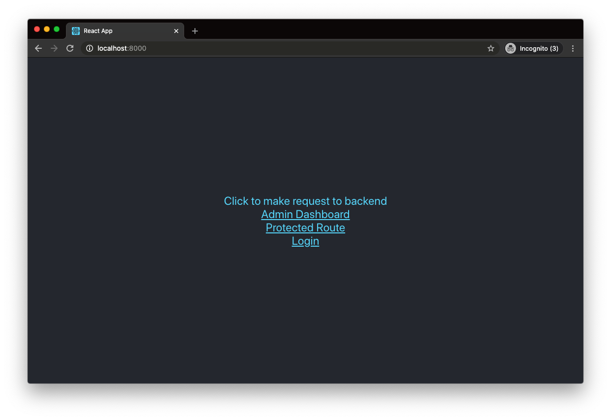
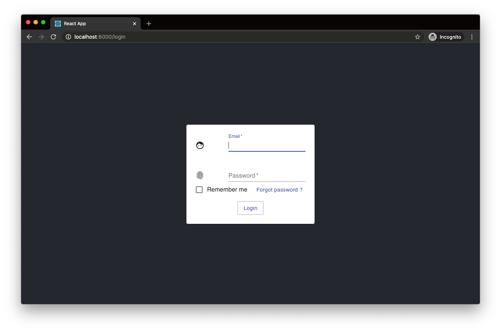
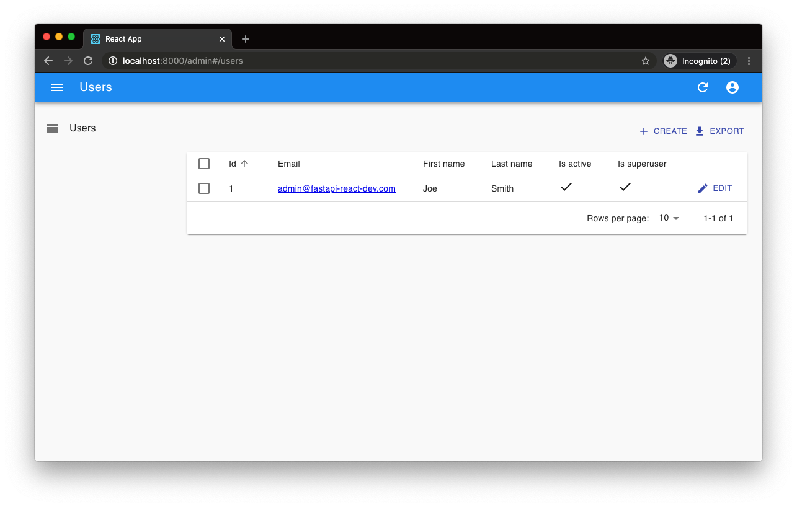

# FastAPI + React ·  [](LICENSE) [](https://dependabot.com)

<div>
  &nbsp; &nbsp;  &nbsp; &nbsp;  &nbsp;&nbsp;&nbsp;
  
</div>

A cookiecutter template for bootstrapping a FastAPI and React project using a
modern stack.

- A slim version of [Buuntu/fastapi-react](https://github.com/Buuntu/fastapi-react) that I've updated and added features to

---

## Features

- **[FastAPI](https://fastapi.tiangolo.com/)** (Python 3.8)
  - JWT authentication using [OAuth2 "password
    flow"](https://fastapi.tiangolo.com/tutorial/security/simple-oauth2/) and
    PyJWT
- **[React](https://reactjs.org/)** (with Typescript)
  - [react-router v5](https://reacttraining.com/react-router/) to handle routing
  - [Utility functions](#Frontend-Utilities) and [higher-order
    components](#Higher-Order-Components) for handling authentication
- **[PostgreSQL](https://www.postgresql.org/)** for the database
- **[SqlAlchemy](https://www.sqlalchemy.org/)** for ORM
- **[Alembic](https://alembic.sqlalchemy.org/en/latest/)** for database
  migrations
- **[Pytest](https://docs.pytest.org/en/latest/)** for backend tests
  - Includes test database, transaction rollbacks after each test, and reusable
    [Pytest fixtures](#fixtures).
- **[Prettier](https://prettier.io/)**/**[ESLint](https://eslint.org/)** (Airbnb
  style guide)
- **[Docker Compose](https://docs.docker.com/compose/)** for development
- **[Nginx](https://www.nginx.com/)** as a reverse proxy to allow
  backend/frontend on the same port
- **[MaterialUI](https://material-ui.com/)** using recommended
  [CSS-in-JS](https://material-ui.com/styles/basics/) styling.
- **[react-admin](https://github.com/marmelab/react-admin)** for the admin
  dashboard
  - Using the same token based authentication as FastAPI backend (JWT)

## Table of Contents

- [Background](#background)
- [Quick Start](#quick-start)
- [Develop](#develop)
- [Admin Dashboard](#admin-dashboard)
- [Security](#security)
- [Testing](#testing)
  - [Fixtures](#fixtures)
    - [test_db](#test_db)
    - [test_user](#test_user)
    - [test_superuser](#test_superuser)
    - [client](#client)
    - [user_token_headers](#user_token_headers)
    - [superuser_token_headers](#superuser_token_headers)
- [Background Tasks](#background-tasks)
  - [Flower](#flower)
- [Frontend Utilities](#frontend-utilities)
  - [Utility Functions](#utility-functions)
    - [login](#login)
    - [logout](#logout)
    - [isAuthenticated](#isauthenticated)
  - [Routes](#routes)
  - [Higher Order Components](#higher-order-components)
    - [PrivateRoute](#privateroute)
- [Deployment](#deployment)
- [Contributing](#contributing)

## Background

It is often laborsome to start a new project. 90% of the time you have to decide
how to handle authentication, reverse proxies, docker containers, testing,
server-side validation, linting, etc. before you can even get started.

**FastAPI-React** serves to streamline and give you that functionality out of
the box.

It is meant as a lightweight/React alternative to [FastAPI's official fullstack
project](https://github.com/tiangolo/full-stack-fastapi-postgresql). If you want
a more comprehensive project in Vue, I would suggest you start there. A lot of
the backend code is taken from that project or the [FastAPI official
docs](https://fastapi.tiangolo.com/).

## Quick Start

First, install cookiecutter if you don't already have it:

```bash
pip3 install cookiecutter
```

Second, install docker-compose if you don't already have it:

[docker-compose installation official
docs](https://docs.docker.com/compose/install/).

Then, in the directory you want your project to live:

```bash
cookiecutter --no-input gh:will-wright-eng/fastapi-react-slim
```

Without `--no-input ` you will need to put in a few variables and it will create a project directory
(called whatever you set for `project_slug`).

<details><summary>Input Variables</summary>

- project_slug [default fastapi-react-slim-project] - this is your project directory
- project_name [default fastapireactslimproject]
- project_name_title [default Fastapi React Slim Project]
- port [default 8000]
- postgres_user [default postgres]
- postgres_password [default password]
- postgres_database [default app]
- superuser_email [default admin@fastapireactslimproject.com]
- superuser_password [default password]
- secret_key [default super_secret]

</details>

## Develop

### Quick Start

The following commands with initalize the app, build and start all the containers, then tail the docker-compose logs

```bash
cd {{cookiecutter.project_slug}}
make open # opens browser where your app will be available
make init # details below
```

Once you see the following logs, reload your browser

```
{{cookiecutter.project_slug}}-frontend-1  | Starting the development server...
{{cookiecutter.project_slug}}-frontend-1  | Compiled successfully!
```

### Step-by-step

Change into your project directory and run:

```bash
chmod +x scripts/build.sh
./scripts/build.sh
```

This will build and run the docker containers, run the alembic migrations, and
load the initial data (a test user).

It may take a while to build the first time it's run since it needs to fetch all
the docker images.

Once you've built the images once, you can simply use regular `docker-compose`
commands to manage your development environment, for example to start your
containers:

```bash
docker-compose up -d
```

Once this finishes you can navigate to the port set during setup (default is
`localhost:8000`), you should see the slightly modified create-react-app page:



_Note: If you see an Nginx error at first with a `502: Bad Gateway` page, you
may have to wait for webpack to build the development server (the nginx
container builds much more quickly)._

Login screen: 

The backend docs will be at `http://localhost:8000/api/docs`. 

## Admin Dashboard

This project uses [react-admin](https://marmelab.com/react-admin/) for a highly
configurable admin dashboard.

After starting the project, navigate to `http://localhost:8000/admin`. You
should see a login screen. Use the username/password you set for the superuser
on project setup.

_NOTE: regular users will not be able to access the admin dashboard_


You should now see a list of users which you can edit, add, and delete. The
table is configured with the REST endpoints to the FastAPI `/users` routes in
the backend.



The admin dashboard is kept in the `frontend/src/admin` directory to keep it
separate from the regular frontend.

## Security

To generate a secure key used for encrypting/decrypting the JSON Web Tokens, you
can run this command:

```bash
openssl rand -hex 32
```

The default is fine for development but you will want something more secure for
production.

You can either set this on project setup as `secret_key` or manually edit the
Python `SECRET_KEY` variable in `backend/app/core/security.py`.

## Testing

This project comes with Pytest and a few Pytest fixtures for easier mocking. The
fixtures are all located in `backend/conftest.py` within your project directory.

All tests are configured to run on a test database using [SQLAlchemy
transactions](https://docs.sqlalchemy.org/en/13/orm/session_transaction.html) to
reset the testing state on each function. This is to avoid a database call
affecting the state of a different test.

### Fixtures

These fixtures are included in `backend/conftest.py` and are automatically
imported into any test files that being with `test_`.

#### test_db

The `test_db` fixture is an empty test database and an instance of a SQLAlchemy
Session class.

```python
def test_user(test_db):
    assert test_db.query(models.User).all()
```

#### test_user

```python
def test_user_exists(test_user):
    assert test_user.email == "admin@example.com"
```

#### test_superuser

```python
def test_superuser(client, test_superuser):
    assert test_superuser.is_superuser
```

#### client

To use an unauthenticated test client, use `client`:

```python
def test_get_users(client):
    client.get("/api/v1/users")
    assert response.status_code == 200
```

#### user_token_headers

If you need an authenticated client using OAuth2 and JWTs:

```python
def test_user_me(client, user_token_headers):
    response = client.get(
      "/api/v1/users/me",
      headers=user_token_headers,
    )
    assert response.status_code == 200
```

Since OAuth2 expects the access token in the headers, you will need to pass in
`user_token_headers` as the `headers` argument in any client request that
requires authentication.

#### superuser_token_headers

```python
def test_user_me(client, superuser_token_headers):
    response = client.get(
      "/api/v1/users",
      headers=superuser_token_headers,
    )
    assert response.status_code == 200
```

## Background Tasks

This template comes with Celery and Redis Docker containers pre-configured for
you. For any long running processes, it's recommended that you handle these
using a task queue like Celery to avoid making the client wait for a request to
finish. Some examples of this might be sending emails, uploading large files, or
any long running, resource intensive tasks.

There is an example task in `backend/app/tasks.py` and an example Celery test in
`backend/app/tests/test_tasks.py`. This test runs synchronously, which is what
Celery docs recommend.

If you are not happy with Celery or Redis, it should be easy to swap these
containers out with your favorite tools. Some suggested alternatives might be
[Huey](https://github.com/coleifer/huey) as the task queue and
[RabbitMQ](https://www.rabbitmq.com/) for the message broker.

### Flower

You can monitor tasks using Flower by going to http://localhost:5555

## Frontend Utilities

There are a few helper methods to handle authentication in `frontend/src/utils`.
These store and access the JWT returned by FastAPI in local storage. Even though
this doesn't add any security, we prevent loading routes that might be protected
on the frontend, which results in a better UX experience.

### Utility Functions

#### login

```typescript
// in src/utils/auth.ts

/**
 *  Handles authentication with backend and stores in JWT in local storage
 **/
const login = (email: string, password: string) => boolean;
```

#### logout

```typescript
// in src/utils/auth.ts

// clears token from local storage
const logout = (email: string, password: string) => void;
```

#### isAuthenticated

```typescript
// Checks authenticated state from JWT tokens
const isAuthenticated = () => boolean;
```

### Routes

Some basic routes are included (and handled in `frontend/Routes.tsx`).

- `/login` - Login screen
- `/logout` - Logout
- `/` - Home
- `/protected` - Example of protected route

### Higher Order Components

#### PrivateRoute

This handles routes that require authentication. It will automatically check
whether the correct token with the "user" permissions is present or redirect to
the home page.

```JSX
// in src/Routes.tsx
import { Switch } from 'react-router-dom';

// Replace this with your component
import { ProtectedComponent } from 'components';

const Routes = () => (
  <Switch>
    <PrivateRoute path="/protected_route" component={ProtectedComponent} />
  </Switch>
);
```

</details>

## Deployment

This stack can be adjusted and used with several deployment options that are
compatible with Docker Compose, but it may be easiest to use Docker in Swarm
Mode with an Nginx main load balancer proxy handling automatic HTTPS
certificates, using the ideas from DockerSwarm.rocks.

Please refer to DockerSwarm.rocks to see how to deploy such a cluster easily.
You will have to change the Traefik examples to Nginx or update your
docker-compose file.

## Contributing

Contributing is more than welcome. Please read the [Contributing
doc](CONTRIBUTING.md) to find out more.
